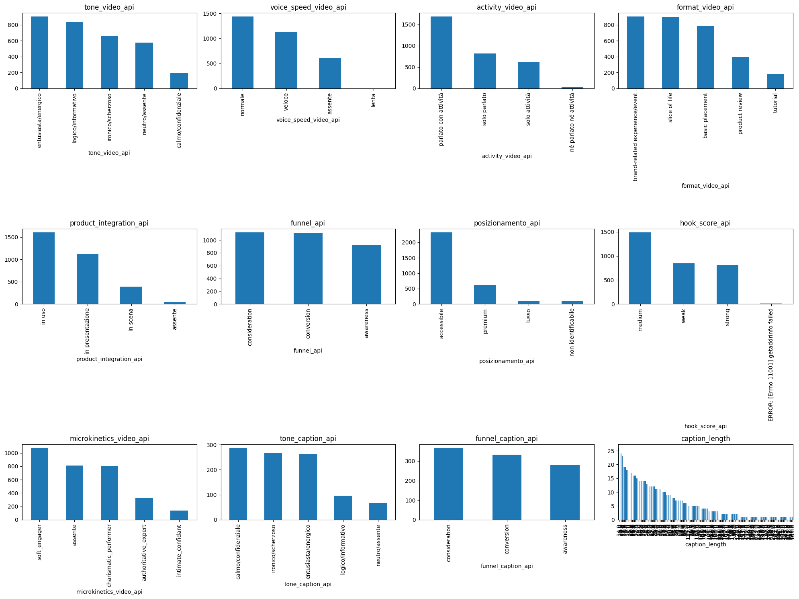
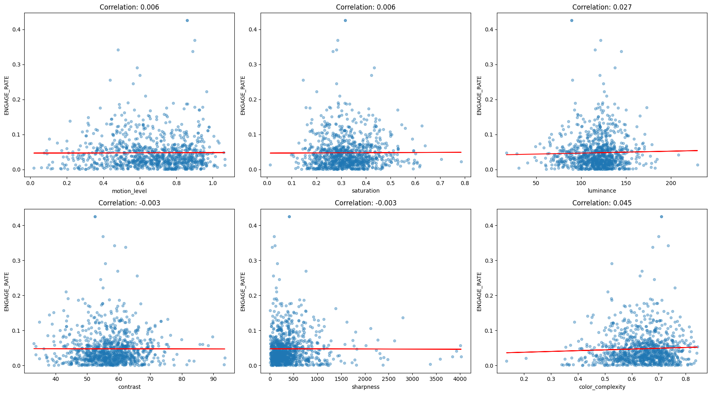
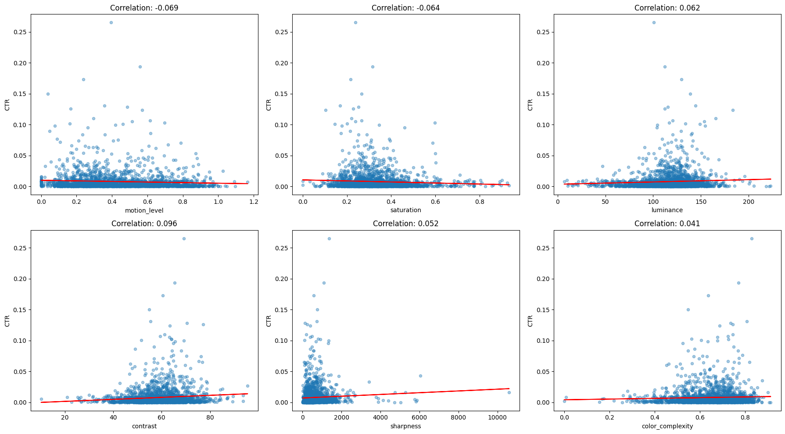
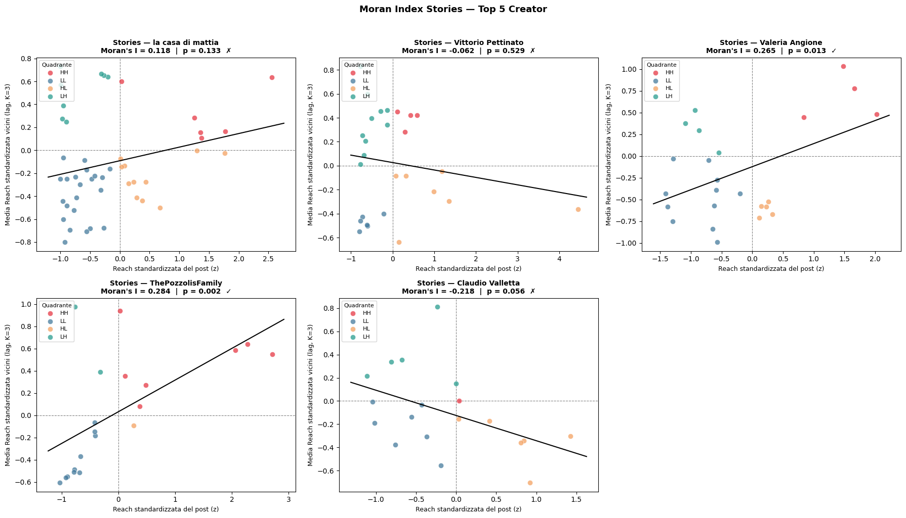
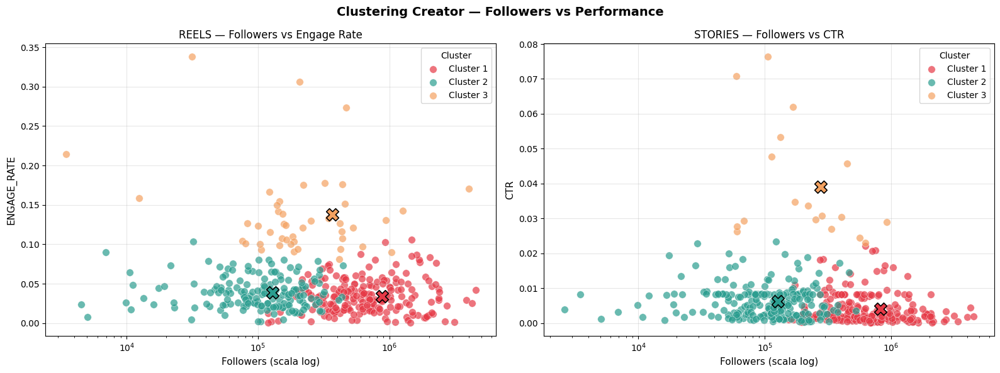
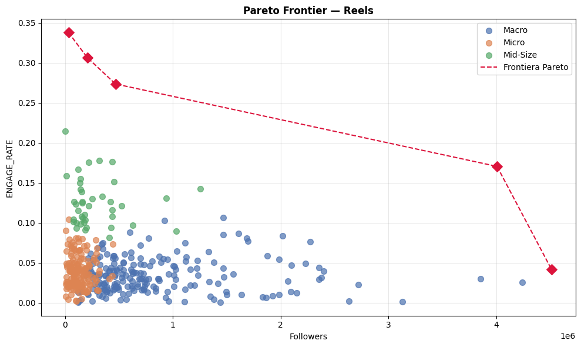
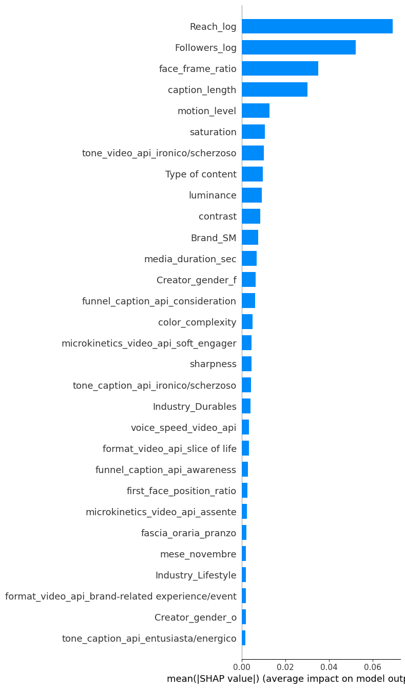
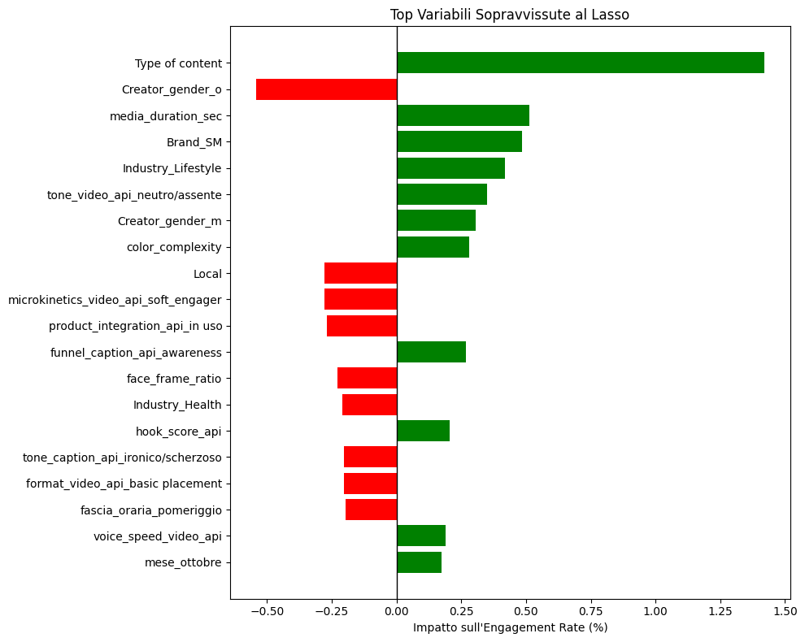
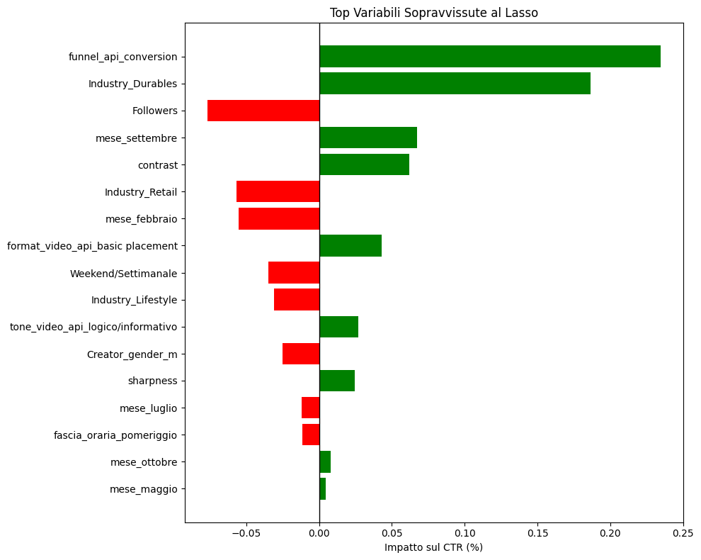

# AFB Project — 30-Slide Report (Content)

*Plain written content, one paragraph per slide, in order. The Title and Agenda below are extras (not counted in the 30). Each numbered paragraph is sized to fit a single slide and is self-contained, so it can be adapted into a presentation without prior knowledge of the project. Quantitative figures, methodological reasoning and managerial implications are all drawn from the project notebooks.*

---

**Title slide (extra — not part of the 30).** *[PROJECT TITLE PLACEHOLDER]* — What Drives Engagement in Influencer Marketing: a Data-Science Analysis of Sponsored Social Video. Course: *[COURSE PLACEHOLDER]* · University: *[UNIVERSITY PLACEHOLDER]* · Group: *[GROUP MEMBERS PLACEHOLDER]* · Date: *[DATE PLACEHOLDER]*.

**Agenda slide (extra — not part of the 30).** (1) Context & Objectives — the business problem, the dataset and what we set out to learn. (2) Methodology — the end-to-end analytical pipeline, the engineered and LLM-extracted features, and why each modelling family was chosen. (3) Results — exploratory findings and the output of five complementary model families. (4) Managerial Implications — creator, timing and content recommendations. (5) The Automation Agent — architecture, roles and workflow. (6) Agent Results — reserved for the full run. (7) Conclusions.

---

## Slide 1 — Context & Background

Influencer marketing has become a core channel for brands, yet the return on sponsored content is hard to predict: the same budget can produce a viral collaboration or a post nobody engages with, and the levers behind that difference are poorly understood. Decisions about which creators to book, what kind of content to brief, and when to publish are still largely made on intuition and follower counts. This project addresses that gap using a real dataset of sponsored creator posts supplied by a partner company. The central premise is that the decisive signal lives not in the raw engagement numbers but in the *content itself* — the way a creator speaks, moves, frames the product and opens the video — which is unstructured and therefore historically unused. By turning that unstructured creative material into structured, analysable variables and combining it with the campaign metrics, the project aims to explain, rather than merely describe, what drives the performance of sponsored social video.

## Slide 2 — The Dataset

The company provided 3,243 sponsored posts, each row corresponding to one published video, spanning three content types: Instagram Stories (about 2,230), Instagram Reels (about 685) and TikTok posts (about 328). For every post the data include the creator and their follower count, the sponsoring brand with its industry and whether it is Italian ("local"), the brand's own social following, and the performance metrics available for that format — reach, likes and comments for feed content, and link clicks for Stories — together with the post's date, time and caption. The company had also pre-computed eight computer-vision metrics per video (face presence and position, motion, saturation, luminance, contrast, sharpness and colour complexity). Because Stories and feed posts expose different metrics and serve different goals, the two are analysed on separate performance questions throughout. Some fields required cleaning (a minority of missing likes and clicks), which is addressed before any modelling.

## Slide 3 — Objectives & Analytical Questions

The work pursues four concrete questions, each tied to a managerial decision. First, *what drives performance*: which creator, content and timing factors raise engagement on feed posts (Reels/TikTok) and click-through on Stories. Second, *who to book*: how creators segment by size and, crucially, by efficiency — engagement obtained per follower. Third, *does success persist*: whether a creator's strong posts cluster in time, so that campaigns can be timed to "hot" periods. Fourth, *what makes content conversational*: which posts generate discussion (comments) rather than passive approval (likes). The methodological spine that makes these questions answerable is the enrichment of the dataset with content features extracted from the videos and captions by a language model, which are then combined with the original metrics and fed into a set of complementary statistical models, before the findings are translated into recommendations for the brand and its agency.

## Slide 4 — Overall Approach & Pipeline

The analysis follows a single end-to-end pipeline: clean the raw data, engineer interpretable features and define the performance targets, extract content features from the videos and captions with a language model, merge everything into modelling tables, explore the data, and then run five complementary model families before drawing implications. The rationale for this design is that no single step is sufficient on its own: the raw metrics describe outcomes but not causes; the unstructured video holds the creative causes but is not directly analysable; and different managerial questions (drivers, segments, dynamics, conversation) require different methods. Structuring the project as a reproducible pipeline also makes every choice explicit and auditable, and — as described later — allowed the entire process to be automated so it can be re-run on new data. Each stage produces a clearly defined output that the next stage consumes.

## Slide 5 — Data Cleaning & Quality

Cleaning was done column by column, checking missing values and plausibility before any transformation. Two genuine gaps required imputation. For the ~51 Reels/TikToks where Instagram hid the like count, likes were estimated by mapping each post's comment percentile onto the like distribution — a rank-preserving estimate that keeps the relationship between likes and comments intact. For the ~267 Stories missing click counts, clicks were imputed from each creator's own average clicks-per-reach ratio applied to that post's reach, respecting creator-level behaviour. Posts without any detected face had no "first-face position", which was set to 1 (face appears at the very end) as a sensible proxy, since a face/no-face flag is modelled separately. Collaborations that appear twice (one row per co-creator) were verified and kept as legitimate, and ambiguous round timestamps were retained as-is on the supervisor's instruction. The guiding principle was to use defensible, distribution-preserving fixes rather than dropping data.

## Slide 6 — Feature Engineering

On top of the cleaned data we engineered interpretable, hypothesis-driven features. From the timestamp we derived a six-band time-of-day variable and the month, and a weekend flag that includes Friday (capturing the Friday-evening start of the weekend). From the face metric we built a simple binary "face present" flag, reasoning that the jump from no-face to any-face matters more than its exact fraction. Two composite visual indices were created from the literature on visual attention and cognitive load: "cognitive overload" (saturation plus motion, both linked to viewer distraction) and "flashiness" (colour complexity, contrast and luminance, rescaled and summed, all positively associated with eye-catching content). These constructs let later models test concrete hypotheses about visual style rather than opaque raw metrics, and keep the feature set both compact and interpretable for a marketing audience.

## Slide 7 — Target Design

Because Stories and feed posts expose different metrics, the data were split and given purpose-built targets. Shared by both is Percentage Reached (reach divided by followers). For Reels/TikTok the headline target is an Engagement Rate defined as (likes + 20 × comments) / reach: comments are weighted far above likes because leaving a comment is a much higher-effort action than a like. The weight of 20 is grounded in a leaked Facebook feed-ranking document in which comments count roughly 15–30 times a like, with 20 taken as a defensible midpoint. A second feed target, Comments-per-Like, isolates how much a post stimulates conversation versus passive approval. For Stories the target is Click-Through Rate (link clicks / reach), the action that matters for that format. Designing one target per business outcome — reach, engagement, conversation, clicks — ensures each model answers a precise, decision-relevant question.

## Slide 8 — LLM Feature Extraction: Rationale & Setup

The richest predictors of performance — how energetic the delivery is, what narrative format the video uses, how the product is integrated, what the caption is trying to achieve — are locked inside unstructured video and text. To unlock them at scale we used a large language model (Gemini 2.5 Flash, run on Vertex AI) as a structured "perception" layer. Each video and caption was sent with a carefully engineered prompt and a strict JSON schema that forced the model to return only a fixed set of categorical variables; the temperature was set to zero for deterministic, reproducible output. Prompts were iterated to be precise and unambiguous, and a human-in-the-loop step compared the model's labels against manual annotations to verify quality before the variables were trusted. This approach gives the analysis content variables that neither the raw metrics nor classical computer vision could provide.

## Slide 9 — The Extracted Content Variables

From the *full video* the model extracted eight variables: communicative tone, speaking speed, a non-verbal "microkinetics" style, the on-screen activity, the narrative format, how the product is integrated, the commercial funnel intent, and the brand's price positioning. The microkinetics variable is methodologically notable: it adapts the Mehrabian framework, scoring the creator on two independent axes — Dominance (how much they command the scene) and Arousal (kinetic energy) — and combining them into four styles (charismatic performer, authoritative expert, soft engager, intimate confidant). From the *first three seconds* the model scored hook strength, and from the *caption* it extracted tone and funnel intent. Together these turn each piece of creative into roughly a dozen structured variables. The chart shows their distributions across the dataset, confirming meaningful variation to model.

## Slide 10 — Exploratory Analysis Approach

Before modelling, every variable was explored both on its own and against the relevant target. Numeric variables were examined with histograms and scatterplots-with-correlation against the target, and categorical variables with frequency bars and target boxplots, all done separately for Reels (against Engagement Rate) and Stories (against Click-Through Rate) so that the two formats' distinct dynamics would not be conflated. The purpose was threefold: to understand the shape and quality of each variable, to get an early read on which signals plausibly matter, and to flag variables that are essentially uncorrelated with the target so that modelling effort and interpretation could be focused. This exploratory pass directly shaped the modelling choices that followed.

## Slide 11 — Modelling Strategy & Why These Methods

Four complementary model families were chosen, each matched to one analytical question. Markov chains and Moran's I address *temporal dynamics* — whether a creator's strong posts persist and cluster in time. KMeans clustering plus a Pareto frontier address *segmentation and efficiency* — grouping creators by size and identifying who delivers the most engagement per follower. A classification model (a Random Forest used with SHAP for feature selection, feeding interpretable classifiers) addresses *what makes content conversational*. A regression model (Lasso for selection, then OLS with an autoregressive lag and creator-clustered standard errors) addresses *the drivers of performance*. The methods were deliberately chosen to be interpretable and appropriate to a modest sample size, and to triangulate the same phenomena from different angles rather than rely on a single black-box model.

## Slide 12 — Results: Exploratory Findings (Reels)

The exploratory analysis of feed content produced several clear signals. TikTok posts achieve markedly higher engagement than Instagram Reels, with a higher median and far greater variance — consistent with TikTok's more virality-driven distribution. Male creators show slightly higher and more dispersed engagement; luxury brands such as Ferrari and Prada and the Lifestyle industry generate the highest engagement despite appearing rarely, suggesting targeted, sparse sponsorships pay off. Longer videos and brands with larger social followings correlate positively with engagement. Strikingly, the eight production/computer-vision metrics (saturation, luminance, contrast, sharpness, colour complexity, motion) are all almost uncorrelated with engagement, as the scatterplots show — "how polished it looks" matters far less than expected, which is precisely what motivated extracting higher-level content features with the language model.

## Slide 13 — Results: Exploratory Findings (Stories)

For Stories, analysed on Click-Through Rate, the picture differs in instructive ways. The Services industry achieves the highest click-through, whereas Lifestyle — the strongest performer for Reels engagement — is the weakest here, an early sign that the levers for clicks and for engagement are not the same. Follower count correlates slightly negatively with CTR, echoing the well-known pattern that smaller, more niche audiences act more readily. Almost all Stories show a face, and motion is concentrated at low values (Stories are calmer, more personal, near-static compared with Reels). As with Reels, the production/computer-vision metrics are essentially uncorrelated with the target, reinforcing that raw visual quality alone does not explain performance and that the content-level features are where the explanatory power must come from.

## Slide 14 — Results: Performance Persistence (Markov Chain)

To test whether success is sticky, each creator's posts were ordered chronologically and labelled by whether their reach was above or below that creator's own average, and the transition probabilities between these "high" and "low" states were estimated. The picture is consistent: a weak post is followed by another weak post about 71% of the time for the top Reels creator, and 69–86% across the top Story creators, while a strong post repeats only about 58% (Reels) and 55–73% (Stories) of the time. In other words, cold streaks are stickier than hot streaks — a creator falls into and stays in a slump more easily than they sustain momentum. The similarity across creators suggests this is partly a structural property of the platforms' distribution rather than a purely individual trait.

## Slide 15 — Results: Temporal Autocorrelation (Moran's I)

Moran's I, an index borrowed from spatial statistics, was used to test whether a creator's high-reach posts cluster together in time: for each post its standardised reach is compared with the average of its three preceding and three following posts. The top Reels creator shows a clearly positive value (I ≈ +0.28), confirming real "hot periods". For Stories the result is creator-specific — strongly positive for several creators (e.g. ThePozzolisFamily +0.28, Valeria Angione +0.27, indicating momentum) but negative for others (Claudio Valletta −0.22, whose peaks are isolated, one-off events). The managerial reading is important: momentum is real but not universal, so timing strategies must be set per creator rather than applied as a blanket rule.

## Slide 16 — Results: Creator Segmentation (Clustering)

To segment creators, the data were aggregated to one row per creator (median reach, followers and performance, with logs to tame skew) and clustered with KMeans into three groups, labelled Macro, Mid-Size and Micro by follower size. The decisive finding is about *efficiency*, not size: Mid-Size creators are dramatically the most effective, with a median Reels engagement rate around 13.8% versus about 3.4% for Macro and 3.9% for Micro, and a median Stories CTR around 3.9% versus roughly 0.4% and 0.63%. Macro and Micro are statistically similar to each other, so simply having more — or fewer — followers does not help unless a creator sits in the mid-size sweet spot. The plot shows the clusters separating clearly on the followers-versus-performance plane.

## Slide 17 — Results: Efficiency Frontier (Pareto)

The clustering insight was confirmed and sharpened with a Pareto frontier: the set of "non-dominated" creators for whom no one else has both more followers and higher performance. For Reels, four of the five creators on the frontier are Mid-Size, and the frontier reveals a clear "breaking point" — efficiency holds up as followers grow until roughly four million, beyond which engagement collapses sharply. For Stories the frontier is more populated and the critical threshold sits around one million followers, after which click-through flattens near zero. The frontier also names the specific best-value creators, turning an aggregate insight into an actionable shortlist of who delivers the most performance per follower.

## Slide 18 — Results: What Sparks Conversation (Classification)

To understand discussion versus passive approval, Reels were split into "Conversational" and "Silent" using the 75th percentile of Comments-per-Like. A Random Forest was trained on all features and SHAP values were used to rank them; the most influential factors are audience scale (reach and followers), followed by face presence, caption length and luminance — and all push posts toward "Silent". The final model is a deliberately interpretable Naive Bayes using only the top five features, reaching a macro-F1 of about 0.64 with a negligible train–test gap (chosen over higher-variance models like XGBoost that overfit this sample). Substantively, conversation is largely an audience-scale phenomenon: very large audiences like passively, whereas smaller, more devoted communities are the ones that actually comment and discuss.

## Slide 19 — Results: Engagement Drivers (Reels Regression)

Engagement drivers were modelled by first using Lasso to select features, then fitting an OLS with an autoregressive lag (the creator's previous post's engagement) and standard errors clustered by creator to respect the panel structure. By far the strongest driver is that lag (≈ +0.51): a creator's recent track record predicts the next post more than any creative choice — momentum, again. Beyond it, posting on TikTok rather than Reels (+0.28), visually rich content (higher colour complexity and saturation), longer duration and a strong opening hook (+0.07) all lift engagement; conversely, showing the product in use, more on-screen face time, local brands, a plain "basic placement" format and an ironic caption tone all depress it. The clear message is that engagement rewards content people enjoy watching, not overt product showcases.

## Slide 20 — Results: Click-Through Drivers (Stories Regression)

The same machinery was applied to Stories' click-through, run on the whole sample and separately on the Macro and Micro clusters (Mid-Size had too few posts). Once more the previous-post lag dominates (≈ +0.44). The single strongest controllable lever is a conversion-oriented funnel intent (+0.34) — unsurprising, since CTR measures the click, not entertainment — while more followers lower CTR (−0.18) and clean, sharp visuals help (in direct contrast to Reels, where saturation helped and here hurts), and evening posting lifts clicks. The clusters differ tellingly: Micro creators convert best with fast, energetic, in-scene-product delivery (a friend-like recommendation), whereas Macro creators are penalised for ironic tone, "consideration-only" content and local brands, performing best with sober, conversion-focused messaging. This separation guides how to brief different creator tiers.

## Slide 21 — Managerial Implications: Creator Strategy

Three creator-side recommendations follow directly from the results. First, prioritise momentum: across every model — the lag in both regressions, the Markov persistence and the positive Moran's I — a creator's *recent* performance is the most reliable predictor of their next post, so campaigns should favour creators who are currently on a hot run rather than relying on historical reputation. Second, choose mid-size creators and the named frontier creators: they deliver several times the engagement-per-follower of mega-influencers, so follower count is a vanity metric and value peaks in the mid-size band. Third, time activations to hot periods for creators who show temporal momentum, while treating each post as independent for the creators whose peaks are episodic (negative autocorrelation). In short, *who* and *when* matter more than fine-tuning the brief.

## Slide 22 — Managerial Implications: Content & Funnel Strategy

On the content side, the decisive lesson is that the right content depends on the objective, because several levers reverse sign between engagement and clicks. For awareness and engagement (Reels), brief entertaining, visually rich content with a strong three-second hook and avoid heavy product showcasing, on-screen-product-in-use and plain placement formats; TikTok should be favoured where engagement is the goal. For traffic and conversions (Stories), use an explicit conversion call-to-action, clean and sharp visuals (not high saturation), and evening posting. Because saturation, hook strength, the basic-placement format and the Lifestyle sector all help one objective while hurting the other, the same piece of content cannot optimise both — the goal must be decided before filming. Briefs should also be tailored by creator tier, with spontaneity and a direct call-to-action for micro creators and sober, conversion-led messaging for macro ones.

## Slide 23 — The Automation Agent: Rationale & Objective

A distinct component of the project makes the whole analysis repeatable. Rather than re-doing the work by hand whenever new campaign data arrive, the pipeline was packaged into an automated agent that can run it end-to-end on its own. The objective is reproducibility at scale: given a fresh dataset of the same kind, the agent performs cleaning, feature engineering, the language-model content extraction, the merge, all five analysis families and the final report, applying exactly the same methodology and the same fixed analytical choices every time. This removes manual effort and the risk of inconsistent re-implementation, makes results auditable, and lets the analysis be deployed on a much larger collection of videos than could be processed by hand. The following slides describe how it is built and how it works.

## Slide 24 — Agent Architecture: Skills

The agent is organised as a set of focused, self-contained "skills", one per pipeline component: cleaning, feature engineering, the three language-model extractions (video, hook, caption), the merge, exploratory analysis, the Markov chain, Moran's I, clustering, the Pareto frontier, classification, regression, and report generation. Each skill is an independently runnable unit with a single responsibility, which keeps the system modular, testable and easy to reason about. Binding them together is one shared configuration that acts as the single source of truth for every fixed choice — the model and its settings, the analytical thresholds and weights, and the mapping of column names — so that behaviour is consistent across runs and a change is made in exactly one place. This component-per-skill design mirrors the original notebook structure, making the correspondence between the manual analysis and its automated counterpart transparent.

## Slide 25 — Agent Roles & Interaction

The skills are coordinated by a small team of specialised roles, each with a clear remit. An orchestrator plans and sequences the run; a data-engineering role handles cleaning, feature engineering and the merge; a feature-extraction role is the only one that interacts with the video model, managing the extraction; an exploratory-analysis role and a statistical-modelling role run the descriptive analysis and the models respectively; a quality-assurance role validates the outputs and checks for problems such as target leakage; and a programming role handles only environment and plumbing, never the analytical logic. The orchestrator delegates each stage in turn, and every role passes well-defined outputs to the next, so the methodology stays fixed while responsibilities remain cleanly separated. This division of labour keeps the automated process both robust and faithful to the intended analysis.

## Slide 26 — Agent Workflow & Adaptation to New Data

In a run, the orchestrator first performs a readiness check, then drives the stages in order. The data are organised into two views: the complete set of posts, used by the analyses that need no content features (segmentation, dynamics), and the subset of posts that have a usable video, used by the content-based models (engagement drivers, conversation). The agent is built to adapt to a new dataset rather than break: when an expected column is absent it adjusts gracefully, and where the original analysis used reach it uses the closest available reach proxy. Every choice that a human originally made by eye — the number of clusters, the conversation cut-off, which creators to analyse for dynamics — is encoded as a fixed, deterministic rule so results are reproducible. The content extraction, the slowest stage, is resumable and can run in parallel to process large video collections efficiently.

## Slide 27 — Agent Results: Overview & Scope *(reserved — to be completed)*

*[PLACEHOLDER — to be filled once the full run is complete.]* This section will report the agent's output on the full collection of approximately 6,000 sponsored feed videos (Instagram Reels and TikTok). It will state the final dataset size after cleaning, how many videos carried extractable content (and therefore enter the content-based models), the set of content variables produced by the language-model extraction, and the two analysis views used. It will frame all subsequent results as the production run on the complete dataset. *(Figures, tables and charts to be inserted here.)*

## Slide 28 — Agent Results: Drivers & Segments *(reserved — to be completed)*

*[PLACEHOLDER — to be filled from the full run.]* This section will present, for the ~6,000 reels, the engagement-driver regression — run on the whole sample and on the two most-populous creator clusters — reporting the leading coefficients, the role of the previous-post momentum effect, and the content levers that raise or lower engagement. It will also present the creator segmentation (the three size clusters and their efficiency) and the Pareto efficiency frontier, identifying the most efficient creator tier and the best-value creators. *(Coefficient tables, cluster summaries and the frontier chart to be inserted here.)*

## Slide 29 — Agent Results: Conversation & Momentum *(reserved — to be completed)*

*[PLACEHOLDER — to be filled from the full run.]* This section will present, for the ~6,000 reels, the Silent-versus-Conversational classification — the final selected model, its performance, and the most informative features distinguishing posts that spark discussion — and the temporal-dynamics analyses, namely the Markov persistence of high-performance states and the Moran's I autocorrelation for the most active creators. Each result will be accompanied by its managerial reading. *(Model comparison, feature-importance chart, transition probabilities and Moran scatterplots to be inserted here.)*

## Slide 30 — Conclusions & Next Steps

Across every analysis, one finding stands out: momentum — a creator's own recent performance — is the strongest and most consistent predictor of how their next post will do, appearing as the dominant term in both regressions and confirmed by the Markov and Moran analyses. Two further conclusions are robust: mid-size creators offer by far the best engagement-per-follower, so value does not scale with audience size; and content must be matched to the objective, since the levers that drive engagement often work against click-through. Methodologically, the project's distinctive contribution is turning unstructured video and captions into structured content variables with a language model, which add explanatory signal that the raw metrics and classical visual metrics lack. The next step is to complete the full ~6,000-video run through the automation agent, confirming these patterns at scale and operationalising the recommendations for the brand and its agency.
